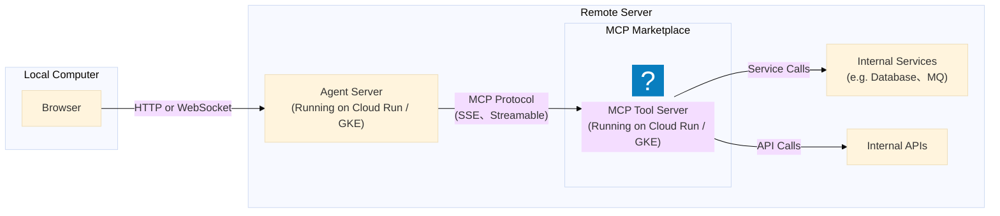

# Python MCP Server

## 🚀 Python MCP Server 的連線方式
本專案示範 三種連線模式實作 Python MCP Server：
- STDIO: [stdio-mode](stdio-mode)
- SSE: [sse-mode](sse-mode)
- Streamable HTTP: [streamable-http-mode](streamable-http-mode)

## 🔍 三種連線模式比較

| 模式                           | 傳輸方式                       | 是否持續連線  | 資料輸出型態        | 適合場景                           | 優勢                   | 缺點                    |
|------------------------------|----------------------------|---------|---------------|--------------------------------|----------------------|-----------------------|
| **STDIO**                    | 標準輸入輸出 (stdin/stdout)      | ❌ 無     | 一次性送出         | CLI 工具、local MCP server、原型開發   | 實作簡單、延遲低、不需 HTTP 伺服器 | 難支援串流回應 & 多用戶、無法跨網路   |
| **SSE** (Server-Sent Events) | HTTP /text/event-stream    | ✔️ 單向持續 | 伺服器 ➜ 客戶端的訊息流 | Web UI 顯示 AI Token-by-token 回應 | 成熟瀏覽器支援、輕量、易實作串流     | 只能單向（無法雙向）、不支援 binary |
| **Streamable HTTP**          | HTTP 雙向 / Chunked / Duplex | ✔️ 可雙向  | Chunk 形式傳輸    | AI 聊天、MCP 工具呼叫、多人協作            | 支援雙向串流、自然適合工具溝通      | 實作較複雜、需伺服器與框架支援       |

## 🔮 未來主流：為何推薦 Streamable HTTP？

Streamable HTTP 結合 SSE 的輕量 與 WebSocket 的雙向能力，特別適合 AI / MCP 的互動模式：
- ✔ 需要時才啟動串流，避免 SSE 長時間佔用連線資源
- ✔ 支援雙向傳輸，符合「AI ↔ Tool ↔ MCP」的交互流程
- ✔ 適合生成長文本、程式碼、推理過程等 AI Streaming Response
- ✔ 自然對應 MCP 的典型「多階段交流模型」：
    ```text
    User → AI → Tool → AI → Response
    ```
因此，隨著 AI 工具的複雜度提升，Streamable HTTP 更適合未來 MCP Server 的主流開發方式。

## Remote MCP Architecture

### MCP Marketplace
- 連線方式
    - 採用 SSE / Streamable HTTP 與 MCP Tool Server 連接
    - 不使用 STDIO 模式（僅適用於 local tool）
- MCP Tool Server 種類：
    - 第三方 MCP Server
        - 由外部社群或廠商提供
    - 自建 MCP Server
        - 依業務需求自行開發與維運
        - 可整合內部系統與資料來源
    - API Proxy MCP Server
        - 將既有 REST / RPC API 封裝為 MCP Tool
        - 作為 MCP 與既有服務之間的轉接層


### MCP 安全性與存取控制
- Authentication
  - https://google.github.io/adk-docs/tools-custom/authentication/
- Tool 使用授權（Tool-level Authorization）
    - 控制 Agent 是否可存取特定 MCP Tool
    - 可依角色、租戶（Tenant）或用途進行限制
- Tool 內部資料授權（Data-level Authorization）
    - MCP Tool 內仍需進行資料層級的權限控管
    - 確保僅能存取被授權的資源與資料範圍
