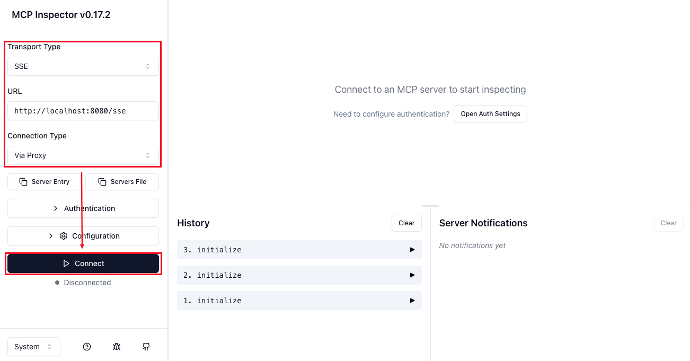
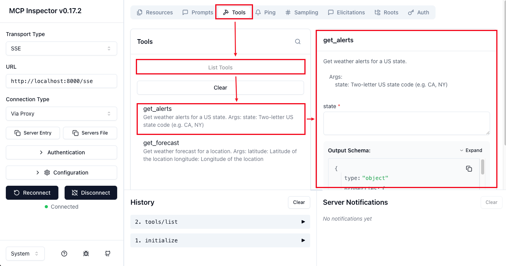

# Python MCP Server (SSE 模式)

## 開發 MCP Server

### 說明
SSE (Server-Sent Events) 模式通常用於將 MCP Server 部署為獨立的 Web 服務，它基於標準的 HTTP 協定。
我們將使用 uvicorn（一個常見的 ASGI Server）來運行我們的 FastMCP 應用程式。

- 參考文件：https://medium.com/nerd-for-tech/building-your-first-mcp-server-with-python-a-beginners-guide-b76665e2b2ff

### 🔧 步驟一：環境準備與 uv 安裝
uv 是用來執行和管理 Python 專案的工具，可以安裝套件、管理環境和執行腳本
1. 安裝指令：
    ```shell
    curl -LsSf https://astral.sh/uv/install.sh | sh
    ```

2. 初始化專案
    ```shell
    # 建立並進入虛擬環境
    uv venv
    source .venv/bin/activate
    
    # 初始化 uv 專案
    uv init
    ```
    執行 uv init 後，會在當前資料夾下生成專案所需的核心檔案：
    - .python-version
    - main.py
    - pyproject.toml
    - README.md

### 📦 步驟二：安裝必要套件
> 💡 對 SSE 模式的 MCP Server 來說，只有 `mcp`+`uvicorn` 是必要的。`httpx` 則是範例中用來處理網路請求的額外套件。
```shell
uv add mcp uvicorn httpx
```

### 📝 步驟三：實現 MCP Server 邏輯

建立 `weather.py`，並輸入以下內容：
```python
# 引入必要模組
from typing import Any
import httpx
from mcp.server.fastmcp import FastMCP
from starlette.applications import Starlette
from mcp.server.sse import SseServerTransport
from starlette.requests import Request
from starlette.routing import Mount, Route
from mcp.server import Server

# 初始化 MCP server，並給予名稱
mcp = FastMCP("weather")

# 建立 MCP Tool: get_alerts
@mcp.tool()
async def get_alerts(state: str) -> str:
    """Get weather alerts for a US state.

    Args:
        state: Two-letter US state code (e.g. CA, NY)
    """

    # 撰寫業務邏輯，並回傳結果
    # 完整內容請參考 Source Code

    return f"Fetching alerts for {state}..."

# 建立 MCP Tool: get_forecast
@mcp.tool()
async def get_forecast(latitude: float, longitude: float) -> str:
    """Get weather forecast for a location.

    Args:
        latitude: Latitude of the location
        longitude: Longitude of the location
    """

    # 撰寫業務邏輯，並回傳結果
    # 完整內容請參考 Source Code

    return f"Forecast for Latitude: {latitude}, Longitude: {longitude}"

# 包裝成 Starlette 框架
def create_starlette_app(mcp_server: Server, *, debug: bool = False) -> Starlette:
    """Create a Starlette application that can server the provide mcp server with SSE."""
    sse = SseServerTransport("/messages/")

    async def handle_sse(request: Request) -> None:
        async with sse.connect_sse(
                request.scope,
                request.receive,
                request._send,  # noqa: SLF001
        ) as (read_stream, write_stream):
            await mcp_server.run(
                read_stream,
                write_stream,
                mcp_server.create_initialization_options(),
            )

    return Starlette(
        debug=debug,
        routes=[
            Route("/sse", endpoint=handle_sse),
            Mount("/messages/", app=sse.handle_post_message),
        ],
    )

# 使用 uvicorn 運行
if __name__ == "__main__":
    mcp_server = mcp._mcp_server

    import argparse

    parser = argparse.ArgumentParser(description='Run MCP SSE-based server')
    parser.add_argument('--host', default='0.0.0.0', help='Host to bind to')
    parser.add_argument('--port', type=int, default=8080, help='Port to listen on')
    args = parser.parse_args()

    # Bind SSE request handling to MCP server
    starlette_app = create_starlette_app(mcp_server, debug=True)

    uvicorn.run(starlette_app, host=args.host, port=args.port)
```


### 🧪 步驟四：測試 MCP Server (使用 Inspector)
使用 uvicorn 啟動 SSE Server，然後再用 MCP Inspector 進行連線測試。

1. 啟動 uvicorn，並指定運行 `weather.py`
    ```shell
    python weather.py --host localhost --port 8080
    ```
2. 確認 uvicorn 啟動資訊，Console 會顯示以下資訊，表示您的 MCP Server 已經在 http://127.0.0.1:8080 上運行：
    ```text
    INFO:     Started server process [85847]
    INFO:     Waiting for application startup.
    INFO:     Application startup complete.
    INFO:     Uvicorn running on http://localhost:8080 (Press CTRL+C to quit)
    ```
3. 啟動 MCP inspector
    ```shell
    npx @modelcontextprotocol/inspector
    ```
4. 確認 Inspector 啟動資訊，Console 會顯示以下資訊，並自動打開瀏覽器：
    ```text
    Starting MCP inspector...
    ⚙️ Proxy server listening on localhost:6277
    🔑 Session token: ada07a3c319d499a3cd65f6ec6f50....
       Use this token to authenticate requests or set DANGEROUSLY_OMIT_AUTH=true to disable auth
    
    🚀 MCP Inspector is up and running at:
       http://localhost:6274/?MCP_PROXY_AUTH_TOKEN=ada07a3c319d499a3cd65f6ec6f50....
    ```
5. 進行連線：選擇 SSE Mode → URL 輸入 http://localhost:8080/sse → 選擇 Vai Proxy → 點 Connect
    
6. 進行測試：切換到 Tools 分頁 → 選擇 List Tools 即可看到您定義工具清單 → 選擇要測試的 Tool → 輸入參數進行測試
    
