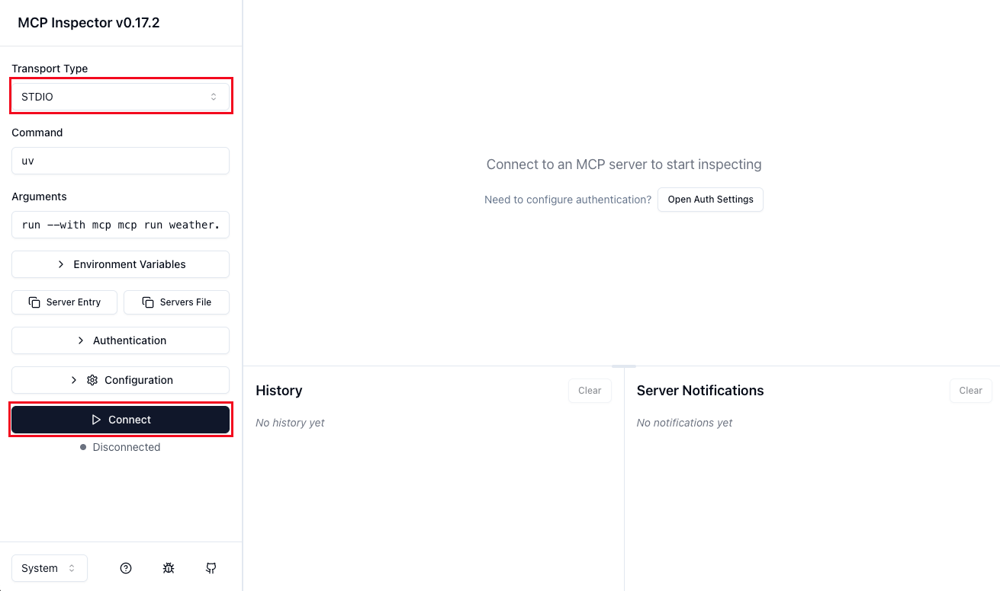
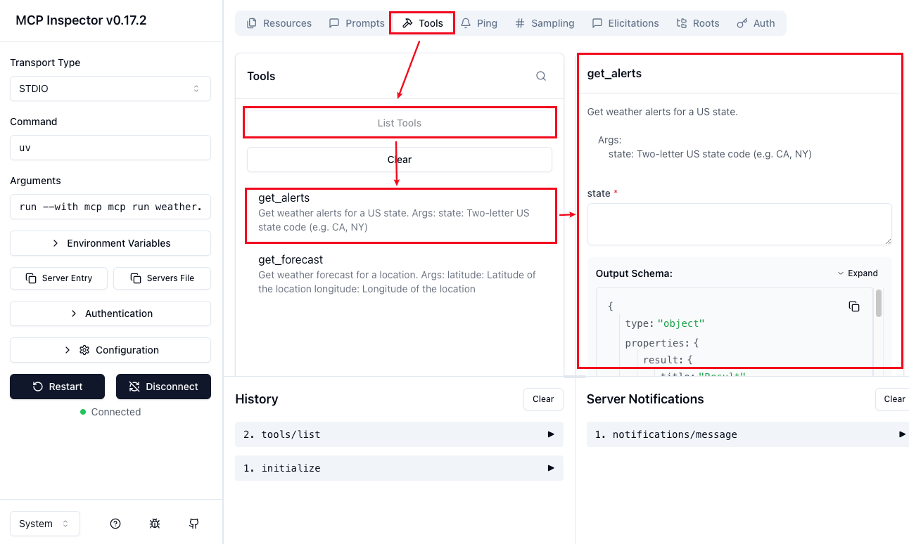

# Python MCP Server - STDIO Mode

## 開發 MCP Server

### 說明
依照官方範例，使用 python 實現 mcp server
- https://modelcontextprotocol.io/docs/develop/build-server#python

### 安裝 uv
uv 是用來執行和管理 Python 專案的工具，可以安裝套件、管理環境和執行腳本
- 安裝指令：
    ```shell
    curl -LsSf https://astral.sh/uv/install.sh | sh
    ```

### 初始化專案
1. Create virtual environment and activate it
    ```shell
    uv venv
    source .venv/bin/activate
    ```
2. Initialize uv project
    ```shell
    uv init
    ```
    執行完，會在當前資料夾下，產生以下檔案：
    - .gitignore
    - .python-version
    - main.py
    - pyproject.toml
    - README.md

### 安裝套件
> 💡 對 mcp server 來說只有 `"mcp[cli]"` 是必要的，`httpx` 是範例中為了查詢天氣另外加的
```shell
uv add "mcp[cli]" httpx
```

### 實現 MCP Server
建立 `weather.py`，並輸入以下內容：
```python
# 引入 FastMCP
from mcp.server.fastmcp import FastMCP

# 初始化 MCP server，並給予名稱
mcp = FastMCP("weather")

# 建立 MCP Tool
@mcp.tool()
async def get_alerts(state: str) -> str:
    """Get weather alerts for a US state.

    Args:
        state: Two-letter US state code (e.g. CA, NY)
    """

    # 撰寫業務邏輯，並回傳結果
    # 完整內容請參考 Source Code
    
    return state

@mcp.tool()
async def get_forecast(latitude: float, longitude: float) -> str:
    """Get weather forecast for a location.

    Args:
        latitude: Latitude of the location
        longitude: Longitude of the location
    """

    # 撰寫業務邏輯，並回傳結果
    # 完整內容請參考 Source Code

    return f"{latitude},{longitude}"
```


### 測試 MCP Server
使用 MCP inspector 工具進行測試
1. 啟動 MCP inspector
    ```shell
    uv run mcp dev weather.py
    ```
2. Console 會顯示以下資訊，並自動打開瀏覽器
    ```text
    Starting MCP inspector...
    ⚙️ Proxy server listening on localhost:6277
    🔑 Session token: ada07a3c319d499a3cd65f6ec6f50....
       Use this token to authenticate requests or set DANGEROUSLY_OMIT_AUTH=true to disable auth
    
    🚀 MCP Inspector is up and running at:
       http://localhost:6274/?MCP_PROXY_AUTH_TOKEN=ada07a3c319d499a3cd65f6ec6f50....
    ```
3. 選擇 STDIO Mode -> 點 Connect
    
4. 選擇 Tools -> List Tools -> 選擇要測試的 Tool -> 進行測試
    
